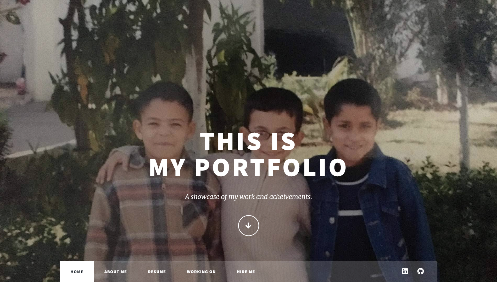

<!-- # [Click to see my Portfolio](https://zakaria-pro.github.io/my-eportfolio.github.io "Zakariae's Portfolio")
 -->
<foreignObject width="100" height="100">
    

        <ul>
            
        </ul>
        <!-- Other embed HTML element/text into SVG -->
    

</foreignObject>
</svg>
